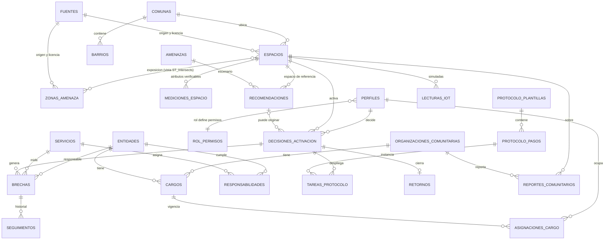
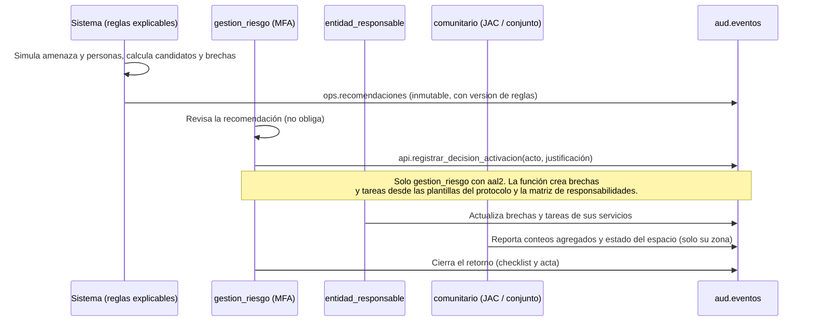

# Modelo de datos de Territorio Preparado (Hito 1, para revisión)

> **Estado:** propuesta para que el responsable de la base de datos la revise y corrija. **No hay SQL todavía**: las migraciones (Hito 2) se escriben cuando este modelo quede aprobado.
> **Motor:** PostgreSQL de Supabase con PostGIS. **Fecha:** 3 de octubre de 2026.
> Fuentes de cada afirmación: `docs/cumplimiento/FUENTES.md` (registro obligatorio) y el Apéndice A del plan.

## 1. Qué problema resuelve la base de datos

Hoy la app (`maqueta3d/`) lee JSON estáticos y guarda el seguimiento en `localStorage`. La base de datos añade lo que la maqueta no puede hacer sola:

1. Guardar **quién decidió activar qué espacio, con qué acto administrativo**, separado de lo que el sistema solo recomendó.
2. Repartir las **brechas y tareas del protocolo** entre las entidades responsables y seguir su estado.
3. Recibir **reportes agregados** de la red comunitaria (juntas de acción comunal y administradores de conjuntos).
4. Controlar **quién ve y quién escribe** qué, con trazabilidad que resista un cambio de administración.

## 2. Principios (no se negocian; salen de `AGENTS.md` §3)

| # | Principio | Cómo se materializa |
|---|---|---|
| 1 | **Exclusión por diseño** | No existe tabla de personas damnificadas, ni columnas para nombres, documentos o menores. El registro nominal es del RUD de la UNGRD (verificar cómo opera hoy). Aquí solo hay conteos agregados. |
| 2 | **Recomienda ≠ decide** | `ops.recomendaciones` (salida del sistema, inmutable) y `ops.decisiones_activacion` (acto humano) son tablas distintas. Solo `gestion_riesgo` con MFA decide, y debe citar el acto administrativo. |
| 3 | **Desconocido ≠ cero** | `NULL` más un estado de verificación (`declarado`, `verificado`, `rechazado`). Hoy los 2.991 espacios tienen capacidad, baños, agua y evaluación estructural en `null`. |
| 4 | **Rol por cargo, no por persona** | `idn.cargos` y `idn.asignaciones_cargo` con vigencia. Cambiar de administración es cerrar una asignación y abrir otra. |
| 5 | **Exposición mínima** | Las tablas viven en `ref`, `geo`, `ops`, `idn` y `aud`, que la API no expone. Solo el esquema `api` (vistas con `security_invoker` y funciones RPC) es visible. |
| 6 | **Real vs simulado** | Cada fila lleva `es_simulado`. IoT y ocupación de demo son siempre simulados (CHECK en la tabla). |
| 7 | **Lo público sobrevive sin la BD** | Las capas abiertas también se publican como snapshots estáticos con `sha256` (hoy ya existen en `maqueta3d/public/data/`). |

## 3. Esquemas

| Esquema | Para qué | ¿Lo expone la API? |
|---|---|---|
| `ref` | Catálogos: fuentes, entidades, amenazas, servicios, responsabilidades, parámetros de reglas, protocolo | No |
| `geo` | Territorio: comunas, barrios, espacios, zonas de amenaza, mediciones, organizaciones comunitarias | No |
| `ops` | Operación: recomendaciones, decisiones, brechas, tareas, reportes, retornos, simulaciones | No |
| `idn` | Identidad: perfiles, cargos, asignaciones, permisos, autorizaciones de tratamiento | No |
| `aud` | Auditoría encadenada por hash | No |
| `api` | Vistas y funciones que consume el frontend y el backend | **Sí (única)** |

## 4. Diagrama entidad-relación

## 5. Flujo operativo (lo que la BD hace cumplir)

## 6. Reglas de integridad que importan

- **Decisión humana obligatoria:** ninguna función ni trigger inserta en `ops.decisiones_activacion` salvo `api.registrar_decision_activacion`, ejecutable solo por `gestion_riesgo` con `aal2`.
- **Justificación exigida:** si la decisión no sale de una recomendación, o activa un espacio distinto al recomendado, `justificacion` no puede ser nula.
- **Faltante calculado, no escrito:** `ops.brechas.faltante` es una columna generada; si `existente` es `NULL`, el faltante es `NULL` (no se convierte en cero).
- **Verificado exige evidencia:** una medición `verificado` necesita `validado_por`, `validado_en` y `evidencia_ref`.
- **Estructura:** `geo.mediciones_espacio` solo guarda si hay evaluación estructural vigente y su fecha; **nunca un concepto técnico** (NSR-10, Ley 400/1997).
- **Simulado forzado:** `ops.lecturas_iot` y `ops.notificaciones` tienen `CHECK (es_simulado)`; no hay envío real en el MVP.
- **Sin textos con datos personales:** los campos de texto libre (`observacion`, `nota`, `valor_texto`) pasan por un filtro que rechaza correos, teléfonos y secuencias numéricas largas.
- **Auditoría inmutable:** `aud.eventos` no admite UPDATE, DELETE ni TRUNCATE y cada fila encadena el hash de la anterior.
- **Supresión de celdas pequeñas:** las vistas públicas ocultan conteos menores al umbral N (`ref.parametros_reglas`, clave `umbral_supresion`; propuesta 5, **lo decide el responsable de la BD**).

## 7. Contrato con la app actual (para no romper nada)

| App (`maqueta3d`) | Base de datos |
|---|---|
| `space.properties.id` = `epou-8413` o `deporte-984` | `geo.espacios.id` (texto, misma cadena) |
| `ScenarioThreat`: `flood`, `earthquake`, `drought`, `wildfire`, `building-fire` | `ref.amenazas.codigo` (mismos códigos) |
| `gaps()[].id`: `toilets`, `water`, `shelter` y las tareas de incendio (`wildfire-perimeter`, `building-inspection`...) | `ref.servicios.codigo` |
| `planningRules`: 20 personas por baño, 15 L por persona al día, 3,5 m² por persona | `ref.parametros_reglas` (clave, valor, fuente, versión) |
| `followup["epou-8413:toilets"] = "Por medir" \| "En revisión"` | `ops.brechas` (`espacio_id`, `servicio_codigo`, `estado` = `por_medir` \| `en_revision`) |
| `responsible: "UAESP"` (texto) | `ops.brechas.entidad_responsable_id` → `ref.entidades` |
| `capacity`, `toilets`, `waterLitersPerDay`, `structuralAssessment` = `null` | `geo.mediciones_espacio` (sin fila = desconocido) |
| `availability = "Por confirmar con la entidad responsable"` | derivado en la vista: sin medición verificada de `disponibilidad` |
| `maximumPeople = 100000` | CHECK `personas_escenario BETWEEN 1 AND 100000` |
| `manifest.json` (licencia, sha256, conteo, fecha) | `ref.fuentes` |

Las reglas de cálculo (`planning.ts`) **siguen en TypeScript**: ya tienen pruebas. La base guarda sus entradas, salidas y la versión de parámetros usada, y es la fuente única de los parámetros.

## 8. Fuera de alcance del MVP

Registro nominal de personas, envío real de SMS, Storage de fotos o documentos (los backups de Supabase no incluyen Storage), alertas oficiales (las emiten IDEAM, CVC, SGC o la autoridad) y cualquier concepto estructural o de Bomberos.

## 9. Decisiones que necesito de ti (gate del Hito 1)

1. **Roles:** ¿la lista de `DICCIONARIO.md` y `ROLES_Y_PERMISOS.md` es la correcta? En especial, ¿`entidad_responsable` puede **validar** mediciones de su servicio, o solo `gestion_riesgo`?
2. **Quién decide:** legalmente decide la Secretaría de Gestión del Riesgo o el Consejo Municipal. El modelo registra un perfil de `gestion_riesgo` como quien **registra** la decisión y exige el acto administrativo que la respalda. ¿Te sirve así?
3. **Grupos de edad** en `reportes_comunitarios`: 0 a 5, 6 a 17, 18 a 59, 60 o más, más un conteo opcional de discapacidad. ¿Dejamos o quitamos discapacidad (dato sensible, siempre opcional y agregado)?
4. **Umbral N** de supresión (propuesta 5) y **retención** (propuestas en `DICCIONARIO.md` §Retención).
5. **Texto libre:** ¿se permite `observacion` (280 caracteres con filtro) o solo campos estructurados? Lo más seguro es solo estructurados.
6. **Idioma de los identificadores:** propongo tablas y columnas en español y códigos de amenaza y servicio en inglés (los de la app).
7. **Repo público o privado** para `db/` (el repo es público hoy).
8. **Animales (decidido por ti el 3 de octubre, ya incorporado):** ver §10. Falta saber **qué entidad de Cali atiende animales** en un albergue y si el municipio cumplió el art. 12 de la Ley 2474 (plazo vencido el 9 de julio de 2026).
9. **Funciones por fase:** ¿aceptas separar `punto_reunion_inmediata`, `albergue` y `acopio` (§11)? ¿El acopio va dentro del albergue, como en la maqueta, o aparte?
10. **Región de Supabase:** São Paulo (propuesta) o EE. UU. este (figura en la lista de la SIC). Ver `docs/cumplimiento/MATRIZ_NORMATIVA.md` §3.

## 10. Mascotas y animales (incorporado en el Hito 1b)

**Respaldo (Ley 2474 de 2025, texto oficial leído):** la gestión del riesgo incluye a los animales; todas las personas y entidades tienen un deber de solidaridad con ellos, **pero prevalece la vida humana** si hay conflicto (art. 3). La UNGRD debe coordinar protocolos que incluyen el **alojamiento temporal** de animales (art. 11); las entidades territoriales debían ajustar sus planes **antes del 9 de julio de 2026** (art. 12); y los sistemas de información territoriales deben incluir información sobre animales e interoperar con el nacional (art. 14). Referentes: PETS Act de EE. UU., guía de mascotas de Japón, Código de Protección Civil de Italia (`docs/referentes/`).

| Dónde | Cambio |
|---|---|
| `ref.servicios` | Nuevo servicio `animals` (atención de animales de compañía), tarea **sin cifra** |
| `ref.responsabilidades` | Entidad por definir (¿Salud Pública y zoonosis, autoridad ambiental u otra?). No se asigna hasta verificarlo |
| `geo.mediciones_espacio` | Atributos `acepta_animales_compania`, `zona_animales`, `capacidad_animales` |
| `ops.reportes_comunitarios` | `n_animales_compania`, agregado y opcional |
| `ref.protocolo_pasos` | Un paso de atención de animales |
| Regla | Los **animales de servicio** siempre se admiten (principio del PETS Act; equivalente colombiano por verificar, quizá la Ley 1618 de 2013) |

Excluido por diseño: registro de dueños o de animales individuales. Solo hay conteos y condiciones del espacio.

## 11. Funciones por fase (incorporado en el Hito 1b)

Japón (2013), Turquía e Italia separan el **punto de reunión inmediato** (horas) del **alojamiento temporal** (días o semanas) y del **acopio**. Se añade `ref.funciones_espacio` con la fase y las amenazas en que aplica, y `punto_reunion_inmediata` como función posible de una decisión. Un espacio apto como punto de reunión tras un sismo puede no serlo como albergue en una inundación. México impide que los refugios temporales funcionen como centros de acopio (por verificar): conviene decidir si la maqueta debe separarlos.

## 12. Fase 2: índice de aptitud y mapa de calor (solo diseño)

Mapas de calor de aptitud de los espacios públicos de toda la ciudad por sismo e inundación. Las tablas previstas están al final de `DICCIONARIO.md`; el método, los datos disponibles y los límites legales, en `docs/referentes/INDICE_APTITUD_Y_MAPA_DE_CALOR.md`. No se escribe SQL hasta aprobar el modelo.
